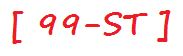

# 99 Problems Solved in Smalltalk

This is a personal attempt at solving the classic ["99 Prolog Problems"](https://sites.google.com/site/prologsite/prolog-problems) .

```smalltalk
"01-Find the last element of a list"
| aList |
aList := OrderedCollection new.
aList add: 'a'; add: 'b'; add: 'c'; add: 'd'.
Transcript open.
Transcript show: aList last.
```

```smalltalk
"02-Find the last but one element of a list"
| aList |
aList := OrderedCollection new.
aList add: 'a'; add: 'b'; add: 'c'; add: 'd'.
Transcript open.
Transcript show: (aList at: (aList size -1 ))
```

```smalltalk
"03-Find the n'th element of a list"
| aList aPosition |
aList := OrderedCollection new.
aList add: 'a'; add: 'b'; add: 'c'; add: 'd'.
aPosition := 4.
Transcript open.
Transcript show: ( aList at: aPosition ).
```

```smalltalk
"04-Find the number of elements in a list"
| aList |
aList := OrderedCollection new.
aList add: 'a'; add: 'b'; add: 'c'; add: 'd'.
Transcript open.
Transcript show: ( aList size ).
```

```smalltalk
"05-Reverse a list"
| aList |
aList := OrderedCollection new.
aList add: 'a'; add: 'b'; add: 'c'; add: 'd'.
Transcript open.
Transcript show: ( aList reversed ).
```

```smalltalk
"06-Find out whether a list is a palindrome"
| aList aListReversed |
aList := OrderedCollection new.
aList add: 'a'; add: 'b'; add: 'b'; add: 'a'.
aListReversed := aList reversed.
Transcript open.
(aList = aListReversed) 
	ifTrue:  [ Transcript show: 'Palindrome']
	ifFalse: [ Transcript show: 'Not palindrome']
```

```smalltalk
"07-Flatten a nested list structure"
| aList aNestedList |
aList := OrderedCollection new.
aNestedList := OrderedCollection new.
aNestedList add: 1; add: 3.
aList add: 'a'; add: 'b'; add: aNestedList; add: 'a'.
Transcript open.
Transcript show: aList flattened.
```

