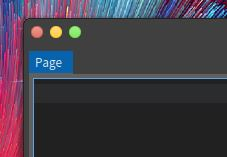
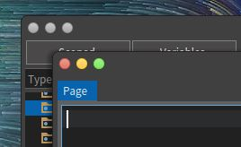
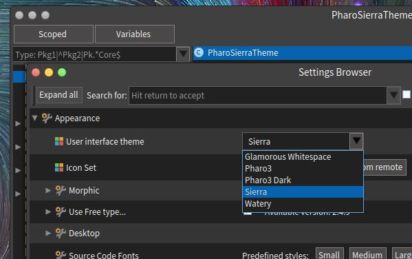

# Literate Smalltalk Programming

Smalltalk is a beautiful language. I love to program in that immersive experience that is to code in this language, environment, and library. All the code is there, all the tools are written in that language and accessible to me, evertyhing is transparent and reflective.

So, what's wrong with Smalltalk?

Well, although the language it is clear, pure, and simple. Although the tools are useful and can be customized to suite my needs. Although object-orientation is taken to the last consequences. Smalltalk is not easy. Getting to know the class library and methods, creating code that is *good* and *beautiful* is difficult.
I want something that tells **me** what I want the computer to do, and at the same time *do that*.
Wouldn't be easier to see something like this:

### A Theme for Pharo that resembles macOS

I wanted to have a more consistent look with macOS Sierra, so I started to look how this could be achieve. Obviously the first step was to subclass the native `Pharo3DarkTheme` class, which is the default theme that comes with Pharo 6.

```smalltalk
Pharo3DarkTheme subclass: #PharoSierraTheme
	instanceVariableNames: ''
	classVariableNames: ''
	package: 'IS-SierraTheme'
```

After searching for the relevant methods I decided I wanted to override those that provide the forms applied to the *close*, *minimize*, and *maximize* buttons.

So I've overrided these:

```smalltalk
PharoSierraTheme >> newWindowCloseForm
			"Anser a new form for a window close box"
			^ self iconNamed: #testRed
```

```smalltalk
PharoSierraTheme >> newWindowMaximizeForm
			"Answer a new form for a window maximize box"
			^ self iconNamed: #testGreen
```

```smalltalk
PharoSierraTheme >> newWindowMinimizeForm
			"Anser a new form for a window minimize box"
			^ self iconNamed: #testYellow
```



Good, that was what I wanted. But also I want that these three buttons, when in passive mode turn to gray. So I've overrided these additional methods

```smalltalk
PharoSierraTheme >> windowClosePasiveForm
			"Answer the form to use for passive window close buttons"
			^ self iconNamed: #testNotRun
```

```smalltalk
PharoSierraTheme >> windowMaximizePasiveForm
			"Answer the form to use for passive window maximize buttons"
			^ self iconNamed: #testNotRun
```

```smalltalk
PharoSierraTheme >> windowMinimizePasiveForm
			"Answer the form to use for passive window minimize buttons"
			^ self iconNamed: #testNotRun
```



Perfect? Not yet, when I move the mouse pointer over the buttons they turn to the old style. So I figured out that I had three more methods to override:

```smalltalk
PharoSierraTheme >> newWindowCloseOverForm
			^ self newWindowCloseForm
```

```smalltalk
PharoSierraTheme >> newWindowMaximizeOverForm
			^ self newWindowMaximizeForm
```

```smalltalk
PharoSierraTheme >> newWindowMinimizeOverForm
			^ self newWindowMinimizeForm
```

Now I want the windows to drop shadows, so I set the color of the shadow and enable that effect:

```smalltalk
PharoSierraTheme >> configureWindowDropShadowFor: aWindow
			aWindow hasDropShadow: true
```

```smalltalk
PharoSierraTheme >>  windowShadowColor
			"Answer the window shadow color to use."
			^ Color gray lighter 
```

Also I was not very happy with the form that scrollbars had in the original theme I wanted something thinner:

```smalltalk
PharoSierraTheme >> scrollbarNormalThumbBorderStyle: aScrollbar
			"Return the normal thumb borderStyle for the given scrollbar"
			^ BorderStyle simple
				width: 2;
				baseColor: Color transparent
```

Finally I want the Settings Manager to take notice of my new theme. I do this by adding a class-side method:

```smalltalk
PharoSierraTheme class >> themeName
				^ 'Sierra'
```



### The dumbest divorce ever: documentation and code

What I did previously was a *tutorial*, a simple walk-through of how to get what I wanted to achive, with explanations, code, and pictures in it. Nice. Useful. But why not actually run that code inside the image?

Yes this document that you are now reading, literate Smalltalk programming: code, explanations, and pictures all together.
See this in the image, execute it in the image and of course save it in the image. After that the code could be accessed through the browser, and treated as part of the system.

*"Instead of imagining that our main task is to instruct a computer what to do, let us concentrate rather on explaining to human beings what we want a computer to do. The practitioner of literate programming can be regarded as an essayist, whose main concern is with exposition and excellence of style. Such an author, with thesaurus in hand, chooses the names of variables carefully and explains what each variable means. He or she strives for a program that is comprehensible because its concepts have been introduced in an order that is best for human understanding, using a mixture of formal and informal methods that re-inforce each other."* **Donald Knuth** on *Literate Programming*
