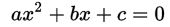
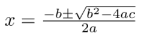
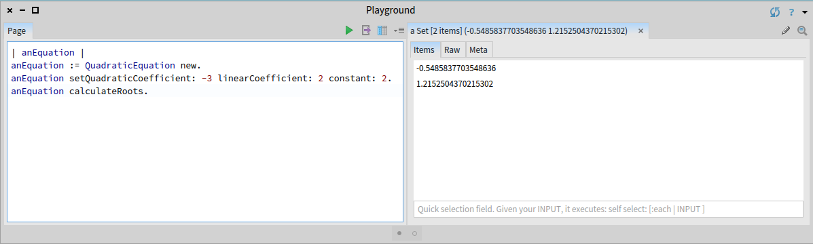

# Solving a Quadratic Equation in Smalltalk

A **[quadratic equation](https://en.wikipedia.org/wiki/Quadratic_equation)** is any equation having the form:



And it is solved using the *quadratic formula*:



First we create the class `QuadraticEquation` with four *instance variables*: `quadraticCoefficient`, `linearCoefficient`, `constant`, and `roots`.

```smalltalk
Object subclass: #QuadraticEquation
	instanceVariableNames: 'quadraticCoefficient linearCoefficient constant roots'
	classVariableNames: ''
	package:'IS-Math'
```

Let's add some comment to the class:

```smalltalk
A QuadraticEquation is a class used to solve Quadratic Equations of the form: ax^2 + bx + c = 0, where a is not 0.

You can set the coefficients using the following method:
setQuadraticCoefficient:  linearCoefficient:  constant: 
Example: Find the roots of -3x^2+2x+2=0
Answer (-0.5485837703548636 1.2152504370215302)

print(it)

| anEquation |
anEquation := QuadraticEquation new.
anEquation setQuadraticCoefficient: -3 linearCoefficient: 2 constant: 2. 
anEquation calculateRoots.
```

First we have to create the accessors of the instance variables

```smalltalk
constant
	^ constant
```

```smalltalk
linearCoefficient
	^ linearCoefficient
```

```smalltalk
quadraticCoefficient
	^ quadraticCoefficient
```

```smalltalk
setQuadraticCoefficient: aNumber1 linearCoefficient: aNumber2 constant: aNumber3
	quadraticCoefficient := aNumber1.
	linearCoefficient := aNumber2.
	constant := aNumber3
```

Now the methods that actually perform the calculation:

```smalltalk
calculateRoots
	"This method sends a message to another method that actually 
	checks if the quadratic equation has real roots. 
	For now imaginary roots are left aside"
	
	^ self calculateRootsIfNone: [ ^ 'No real solution for the equation' ]
```

```smalltalk
calculateRootsIfNone: aBlock
	"The discriminant checks that we are not attempting to calculate the square root of a
    negative number, which will produce an error. If the testing is true then the roots are
    calculated if not aBlock is evaluated."

	| discriminant |
      discriminant := linearCoefficient  squared - ( 4 * quadraticCoefficient  * constant).
	
	discriminant  >= 0 
			ifFalse: aBlock
			ifTrue: [ ^ self solveRoots: discriminant]
```

```smalltalk
solveRoots: aDiscriminant
	"This is the method that after checking that the equation has real solutions
	performs the calculation."
	
	| rootA rootB |
	roots := Set new.
	rootA := (linearCoefficient  negated + aDiscriminant sqrt) / (2 * quadraticCoefficient).
	rootB := (linearCoefficient  negated  - aDiscriminant sqrt) / (2 * quadraticCoefficient).
	roots add: rootA; add: rootB.
	^ roots 
```

