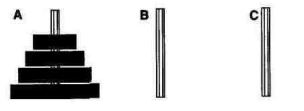
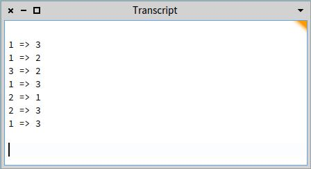

# The Tower of Hanoi

***for Pharo 5.0 - Ignacio Sniechowski***

*An ancient myth has it that in some temple in the far east, time is marked off by monks engaged in the transfer of 64 disks from one of three pins to another. The universe as we know it will end when they are done. The monks can only move one disk at a time; the disks all have different diameters, and no disk can ever be placed on top of a smaller one.*

We are going to begin with only 4 disks.

 

We begin to solve *The Towers of Hanoi* problem for a **stack** of height `n` by trying to solve it for a **stack** of height `n - 1`. This solution must wait until we solve for `( n - 1 ) - 1`, and so on. Eventually we get to the trivial case of `n` equaling `1`, and can being to work our way back up. This is the heart of what will become our recursive solution to the problem.

**To move `n` disks from peg `A` to peg `C`:**

1. Move `( n - 1 )` disks from `A` to `B`.
2. Move `1` disk from `A` to `C`.
3. Move `( n - 1 )` disks from `B` to `C`.

In steps 1 and 3, we will use the remaining peg as an auxiliary "holding" peg.


We have to define two methods for doing this:

```smalltalk
moveTower: height from: aPin to: anotherPin using: otherPin
	"Recursive procedure to move the disk at a height from one pin to another 
	 pin using a third pin"
	 
	 (height > 0) ifTrue: [
       		self moveTower: (height - 1) from: aPin to: anotherPin using: otherPin.
       		self moveDisk: fromPin to: toPin.
       		self moveTower: (height - 1) from: otherPin to: anotherPin using: aPin].
```

```smalltalk
moveDisk: fromPin to: toPin
	"Move disk from a pin to another pin. Print the results in the Transcript"
	
	Transcript cr.
	Transcript show: (fromPin printString, ' => ', toPin printString).
```

If we enter this code as two methods in a simple class called `Hanoi` in the `Browser` and do:

```smalltalk
| aTower |
aTower := Hanoi new.
aTower moveTower: 3 from: 1 to: 3 using: 2.
```

We get:




However, this solution is not really *object-oriented*, it looks very much like a program in other imperative or procedural languages. It contains some *objects* but they are not exhibiting the full power of object-oriented programming. 

Let's add another method that allows us to generalize the game with `n` disks:

```smalltalk
hanoi: numberOfDisks
	"Tower of Hanoi. Sets the game for numberOfDisks"
	
	Transcript cr.
	Transcript show: ('Tower of Hanoi for: ', numberOfDisks printString).
	self moveTower: numberOfDisks from: 1 to: 3 using: 2.
```

Now let's group togheter all these methods into one class: the `TowerOfHanoi` class.

```smalltalk
Object subclass: #TowerOfHanoi
	instanceVariableNames: 'stacks'
	classVariableNames: ''
	package: 'Games'
```

As every class in the system should have a comment associated with it, we can enter a comment such as:

```smalltalk
'stacks' is an Array of stacks. Each stack is an 'OrderedCollection'.
The objects we put on the stacks are characters.
A is the smallest disk, B is larger, etc.
addFirst: is the message for push.
removeFirst: is the message for pop.
```

An now re-define the `hanoi: numberOfDisks` method to reflect the use of an Array:

```smalltalk
hanoi: numberOfDisks
	"Tower of Hanoi. Sets the game for numberOfDisks"
	
	Transcript cr.
	Transcript show: 'Tower of Hanoi for: ', numberOfDisks printString.
	stacks := (Array new: 3) collect: [ :each | OrderedCollection new].
	(numberOfDisks to: 1 by: -1) do: [ :each | (stacks at: 1) addFirst:
						(Character value: ($A asciiValue) + each - 1)].
	self moveTower: numberOfDisks: from: 1 to: 3 using: 2.
```

A **dissection** of this method:

`Array new: 3` Creates an array of 3 elements.

`OrderedCollection new` creates a stack for each of the 3 elements of the `Array`.

We use the standard Smalltalk iterator: `do:` which can be generalized by: 

​										`(1 to: someNumber) do: [ :each | statements ].`

A backwards counting loop would be:

​										`(someNumber to: 1 by: -1) do: [ :each | statements ].`

To index an `Array` we use the `at:` message selector. This refers to the first element of `stacks`:

​										`stacks at: 1.`

The remaining operations create characters that represent disks and then push them onto a stack. Using methods that are part of the Smalltalk system, we can convert an integer `n` to its corresponding `ASCCII` character by:

​										`Character value: n.`

The method to push an element onto a stack is `addFirst:`. Now, putting all together:

```smalltalk
(numberOfDisks to: 1 by: -1) do: [ :each | (stacks at: 1) addFirst: 
					(Character value: ($A ascciiValue) + each - 1)].
```


